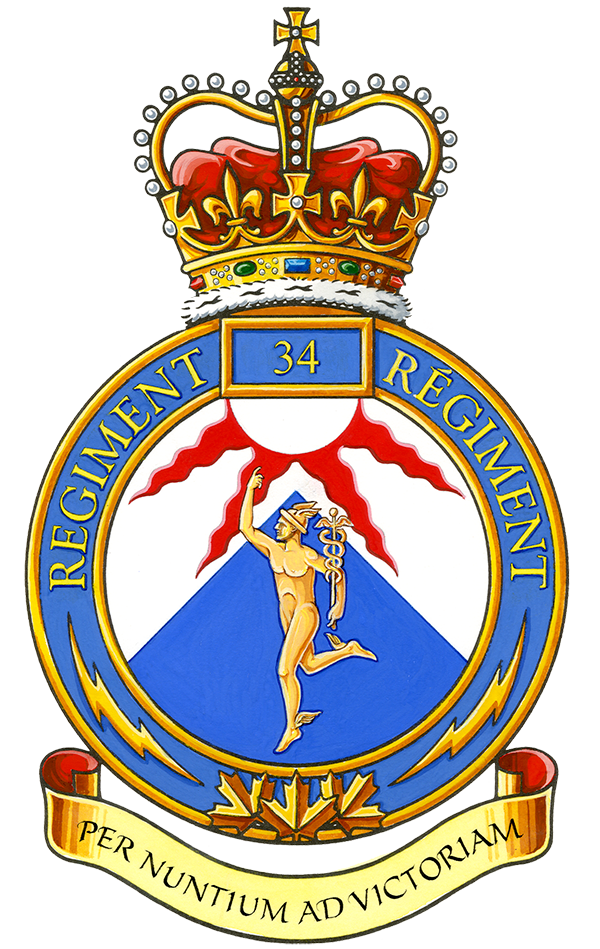
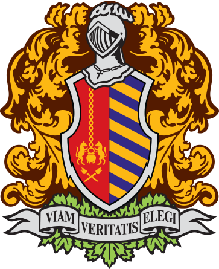

# Andrew Yao
Student, Canadian Reserves

<a href="lyao.andrew@gmail.com">lyao.andrew@gmail.com</a>
| (514) 562-6339 |
<a href="https://www.linkedin.com/in/andrew-yao-143711243"> Linkedin </a>

## Summary
- Assisted in building the first cybersecurity troop in the Canadian Reserves
- Experienced in Security Onion and Threat Hunting
- Certified: GSEC, GCIH, GCIA and GMON

## Experience
### Army Communication Information System Specialist
 
Canadian Armed Forces
Oct 2019 - Present (4 years)

## Education

 
### Polytechnique Montréal
Electrical and Electronics Engineering
2022 - 2026

 
### Collège Jean-de-Brébeuf
Conventum 2014

## Achievements

### BrébeufHx
Winning Team 
Brébeuf Hackathon 2018

### Letter of Appreciation
From the Director of Cyber Operations Force Development - RMC Kingston Detachment
CyberX 2023

## Other

Availability: 1 week notice

<!-- ### Footer

Last updated: September 2023 -->

